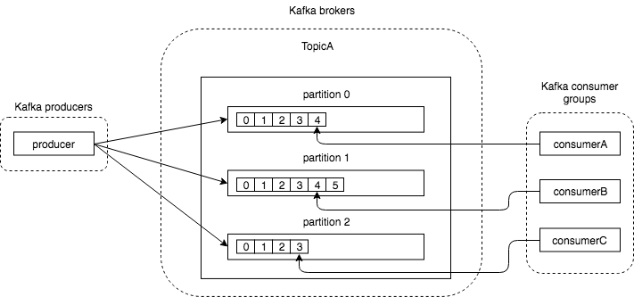

# BurrowによるKafka流量モニタリング

## @kanga333 (Kagawa Shoichi) 

---

# 自己紹介

# 

- @kanga333 (香川翔一)
- MicroAd,Inc. インフラチーム
- データ基盤やコンテナ基盤の設計〜運用
---

# アジェンダ

- MicroAdにおけるKafkaの利用について
- Burrowについて

---

# MicroAdの紹介


- 事業内容
  - アドプラットフォーム
  - データプラットフォーム
- SSP/DSP/DMPを提供
  - COMPASS
  - BLADE
  - UNIVERSE

---

# MicroAdにおけるKafka利用

- ログ集約基盤
  - fluentd中継サーバの構成からKafkaを利用する構成に刷新中
  - ログを集約する際のハブ/キューとして利用
  - 流量はそれなりだがレイテンシに対する要求は厳しくない

---

# クラスタ

- 150,000 record/sec
- 3 TB/day
- 1X brokers
- version 0.10.2
- オンプレのサーバにCloudera Managerでデプロイ

---

# 流量監視の必要性

- ログは成長する
  - カラムが追加される
  - 件数が増える
  - 取り込み対象がふえる
- 書き込み先の負荷も変化する
  - 障害によるノード増減
  - 重い処理の実行

問題なく取り込めていたログもいつの間にか遅延するように

---

# Burrow概要

- https://github.com/linkedin/Burrow
- linkdin製
- consumerのlagをベースに遅れを検知
  - lagが単調増加している場合アラート
- httpサーバとして動作
  - JSON形式でconsumerの状態が確認できる
- 0.8系の方法にも対応
- mail/httpで通知できる
- 複数Burrowを起動した際の通知の排他制御が可能

---

# KafkaのTopic/Partition/Offset/ConsumerGroup

用語おさらい



- TopicAのパーティション1の最新offsetは5
- Coumer groupのconsumerBが見ているoffsetは4
- consumerBのlagは1

---

# BurrowのEvaluation Window

- 時系列でconsumerのoffset/lag/timestampを格納したもの
- デフォルトのEvaluation Windowは10個（以下の例は5）
- BurrowはこのEvaluation Window全体に対して遅延を評価する

|  | W1 | W2 | W3 | W4 | W5 |
| --- | --- | --- | --- | --- | --- |
| **Offset** | 10 | 20 | 30 | 40 | 50 |
| **Lag** | 0 | 0 | 1 | 2 | 3 |
| **Timestamp** | T | T+10 | T+20 | T+30 | T+40 |

※burrow wikiより引用

---

# 評価ルール

主なルールを紹介

1. window内に一つでもlag0のタイミングがある
  -> OK
1. window内でconsumer offsetが変化せずlagが固定または増加
  -> STALLED
  consumerが機能していない
1. consumer offsetが増加してもlagがwindow内で単調増加した場合 
  -> WARRNING
  consumerの取り込みが遅れている

---

# OKの例

|  | W1 | W2 | W3 | W4 | W5 |
| --- | --- | --- | --- | --- | --- |
| **Offset** | 10 | 20 | 30 | 40 | 50 |
| **Lag** | 0 | 0 | 1 | 2 | 3 |
| **Timestamp** | T | T+10 | T+20 | T+30 | T+40 |

lagが0のタイミングがあるのでOK

ただし、W3〜W5のタイミングで単調増加の傾向がある
-> W6,W7と進んでいくとWARNNINGになる可能性

---

# WARNNINGの例

|  | W3 | W4 | W5 | W6 | W7 |
| --- | --- | --- | --- | --- | --- |
| **Offset** | 30 | 40 | 50 | 60 | 70 |
| **Lag** | 1 | 2 | 3 | 4 | 5 |
| **Timestamp** | T+20 | T+30 | T+40 | T+50 | T+60 |

offsetが進んでいてもlagが単調増加しておりconsumeが遅延していると
みなされる

---

# OKの例 その2

|  | W1 | W2 | W3 | W4 | W5 |
| --- | --- | --- | --- | --- | --- |
| **Offset** | 10 | 20 | 30 | 40 | 50 |
| **Lag** | 1 | 3 | 2 | 1 | 4 |
| **Timestamp** | T | T+10 | T+20 | T+30 | T+40 |

W1とW5を比較するとlagは増加しているがW3,W4など
一部のポイントではlagが減少したた
-> consumeは追いついているとみなされOK

---

# STALLEDの例

|  | W1 | W2 | W3 | W4 | W5 |
| --- | --- | --- | --- | --- | --- |
| **Offset** | 10 | 10 | 10 | 10 | 10 |
| **Lag** | 1 | 2 | 3 | 3 | 4 |
| **Timestamp** | T | T+10 | T+20 | T+30 | T+40 |

window全体でconsumer offsetに変更が無い
lagは増えているのでtopicへは書き込みが続いている
-> consumeが止まっているとみなされる

---

# JSON

- offsetの状況などはAPIで確認できる

```
/v3/kafka/kafka-clusterA/topic/topicA
```

```
{  
   "error":false,
   "message":"topic offsets returned",
   "offsets":[  
      11584339277,
      12239048458,
      12304385980
   ],
   "request":{  
      "url":"/v3/kafka/kafka-clusterA/topic/topicA",
      "host":"8a2eb4de78c9"
   }
}
```

---

# 通知

- HTTPかMAILで通知をすることが可能
- 通知の文面をgoのtemplate形式で書ける
- チャットツールへの通知はHTTP通知のテンプレートで実現
  - Slack通知用テンプレートは公式がサンプルとして提供

---

# 通知の排他制御

- 冗長化のため2ノードburrowを立ち上げたい
- が、同じ通知が複数のサーバから来るのは避けたい
- zookeeperを使って排他制御してくれる


---

# 起動

- シングルバイナリを実行
- 設定ディレクトリを指定
- 設定はtoml/yaml/jsonで書ける

```
$ burrow --config-dir /etc/burrow
```

---

# その他

- offsetの推移をグラフで見たい
  - prometheus
    - burrow_exporterを使う
      - topicのoffset
      - consumerのoffset/lag
      - etc...
    - アラートもprometheusに寄せれば良いのでは？
      という気が...

---

# 参考

- Burrow github wiki
  - https://github.com/linkedin/Burrow/wiki/
- Linkdin Blog
  - https://engineering.linkedin.com/apache-kafka/burrow-kafka-consumer-monitoring-reinvented