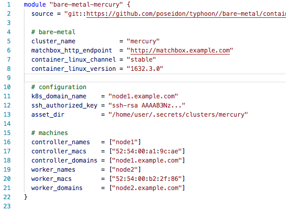

<!-- *template: gaia -->

## CoreOS Container Linuxで始める
## ベアメタルKubernetes


###### kagawa shoichi (@kanga333)
###### 2018/4/18 
###### Japan Container Days v18.04 Meetup

---
<!-- *template: invert -->

## 自己紹介


- @kanga333(香川翔一)
- MicroAd,Inc インフラチーム
  - 広告配信サーバやデータ基盤などを構築/運用

---

<!-- *template: invert -->
## はじめに

---
<!-- *template: invert -->
## 話す内容
- CoreOS Container Linux(CL)とbootkubeを使ってk8sクラスタを
ベアメタル環境に作成する方法を紹介
  - 構築するクラスタの特徴
    - ホストOSのカーネル更新をk8sから管理できる
    - k8sのマスターコンポーネントをk8sで管理できる

---
<!-- *template: invert -->
## CoreOS Container Linux(CL)とは
- アプリケーションをコンテナで動かすことに特化したホストOS
- 最初からコンテナランタイムが付属
  - 最新のdocker / rkt
- 最小限のユーザランド
- カーネルの自動更新機能
  - 数週間で新しいカーネルが降ってくる
 
---
<!-- *template: invert -->
## bootkubeとは
- Self-Hosted Kubernetesなクラスタを構築するツール
  - k8sを使ってk8sのマスターコンポーネントをデプロイする
    - kube-schedulerはdeployments
    - kube-apiはdaemonsets(masterのみ)
    - など
  - Kubernetes Meetup Tokyo #8で詳しく解説されてる[1]
- bootkubeは仮のマスターコンポーネントを立ち上げたあと
kubelet配下にマスターコンポーネントを立ち上げ直す
---
<!-- *template: invert -->
## k8s構築の流れ

---

<!-- *template: invert -->
## MatchBoxの用意と設定
  - MatchBox
    - https://github.com/coreos/matchbox
    - CL向けのプロビジョンサーバ
      - Redhat系OSにおけるkickstartみたいなもの
    - MACアドレスやHWのUUIDなどを元にインストールする内容を設定できる
    - terraformで設定を展開可能
  - NetworkBootにはiPXEやDHCPなども必要 (割愛) [2]

---
## MatchBoxの動作イメージ


---
<!-- *template: invert -->
## TerraformでMachBoxの設定を展開
- TyphoonというTerraformモジュールを利用
  - https://typhoon.psdn.io/
  - CLの上にbootkubeでk8sを作るMatchBoxの設定を展開
  - terraformのtlsプラグインで証明書も自動生成


 
---
<!-- *template: invert -->
## 設定例



---

<!-- *template: invert -->
## サーバの電源ON~BOOT
- MatchBoxに展開された設定を元に各ロールのCLが立ち上がる
- 立ち上がったCLに対してtyphoonはsshで証明書を配布する 
# 


---
<!-- *template: invert -->
## 各Controllerでetcdが起動
- systemdによりコントローラーでetcdクラスタが立ち上がる
# 


---
<!-- *template: invert -->
## 各CL上でsystemd kubeletが起動
- systemdにより全台でkubeletが立ち上がる
- kubeletはkube-apiにつなぎに行こうとする
# 


---
<!-- *template: invert -->
## bootkubeをコントローラー１台で起動
- bootkubeにより仮設のマスターpodが起動する
  - 起動はkubeletのstatic podにより実現(--pod-manifest-path)


---
<!-- *template: invert -->
## 仮設kube-apiを介して各種podが起動


---
<!-- *template: invert -->
## bootkubeの完了
- 仮設のマスタpodととbootkubeが停止


---
<!-- *template: invert -->
## 完成

---
<!-- *template: invert -->
## プラスアルファ

---
<!-- *template: invert -->
## container-linux-update-operator
- https://github.com/coreos/container-linux-update-operator
- ホストCLのカーネルアップデートを管理してくれるOperator
- 新カーネルが降ってくると１台づつ順次アップデートする
  - locksmithをk8s版
- githubからcloneしてkubectl applyで展開

```
cd container-linux-update-operator
kubectl apply -f examples/deploy -R
```
---
<!-- *template: invert -->
## 感想
- 学習コスト高い
  - 環境を一度整えればk8s構築/運用は楽になってく
- Typhoonカスタマイズしたい
  - 例えばカーネルパラメータ変更したり
  - forkして修正するより他ない
- 現状etcdとkubeletは非k8s配下
  - bootkubeは現在etcd-operatorとの統合中らしい
- まだk8sのアップデートはそれなりに大変
  - 全部のコンポーネントがk8sに乗ったらkubernetes-operatorとか出るはず
  - 今はk8sもimmutableな運用をするのが良い

---
<!-- *template: invert -->
## おわりに

- CoreOSのエコシステムに乗っかったk8sのデプロイ方法を紹介
  - カーネルの更新やk8sのControllePlaneをk8sで管理できる
  - ゆくゆくはすべてk8sで管理できるはず
- マイクロアドでは数百台規模の広告配信サーバをk8s化していきたい人募集してます！

---

## 参考
1. https://www.slideshare.net/atoato88/kubernetes-meetup-tokyo-8-selfhosted-kubernetes
2. https://qiita.com/kanga/items/73e589318a66e6813e15